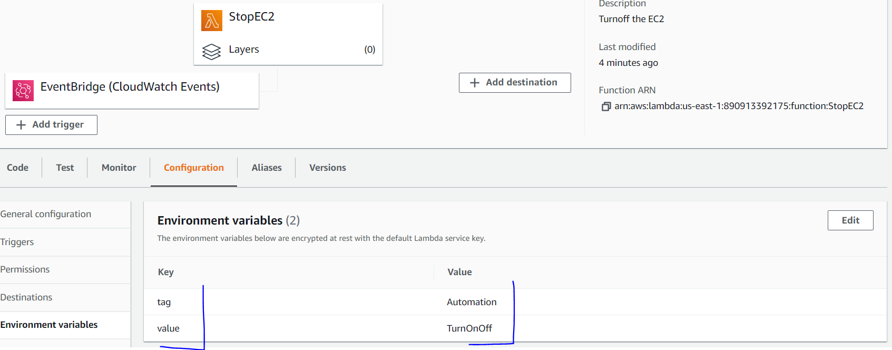
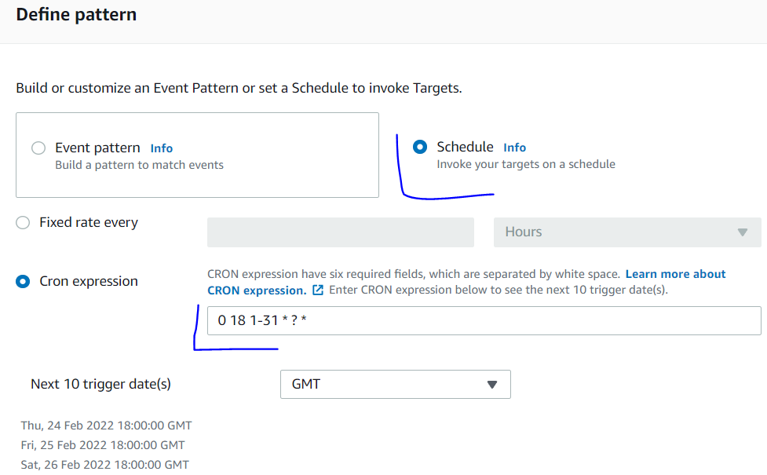

## Mematikan EC2 Instance Sesuai Jadwal

1. Buat Lambda function dengan bahasa pemrograman Python. Source code-nya untuk mematikan EC2 berdasarkan tag bisa diakses [disini](stop-ec2.py) dan untuk menghidupkan EC2 [disini](start-ec2.py).
2. Buat IAM Role untuk Lambda function dan berikan IAM Policy seperti berikut:
```
{
    "Version": "2012-10-17",
    "Statement": [
        {
            "Effect": "Allow",
            "Action": [
                "logs:CreateLogGroup",
                "logs:CreateLogStream",
                "logs:PutLogEvents"
            ],
            "Resource": "arn:aws:logs:*:*:*"
        },
        {
            "Effect": "Allow",
            "Action": [
                "ec2:DescribeInstances",
                "ec2:Start*",
                "ec2:Stop*"
            ],
            "Resource": "*"
        }
    ]
}
```
3. Setting environment variable untuk mengatur tag mana yang akan digunakan untuk menentukan EC2 mana yang akan dimatkan. 
4. Buat Amazon EventBridge rule untuk menjadwalkan mematikan EC2 instance. Jika kesulitan dalam mempelajari penjadwalan via cron, bisa coba akses [disini](https://docs.aws.amazon.com/AmazonCloudWatch/latest/events/ScheduledEvents.html). 
5. Pilih AWS Lambda function yang kita buat sebelumnya. 
